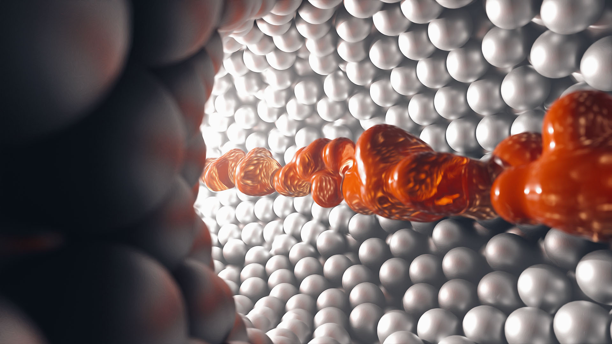

In 2016 I did a "Daily Render" challenge and called it "PROPRIUS".
Proprius is a latin word and has several meanings: steady, individual, personal.
Out of the 366 images I want to present my personal favourites.

[Visit the Behance Project](https://www.behance.net/gallery/61747105/Best-of-PROPRIUS-2016)

